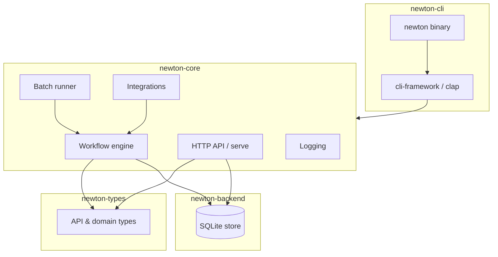
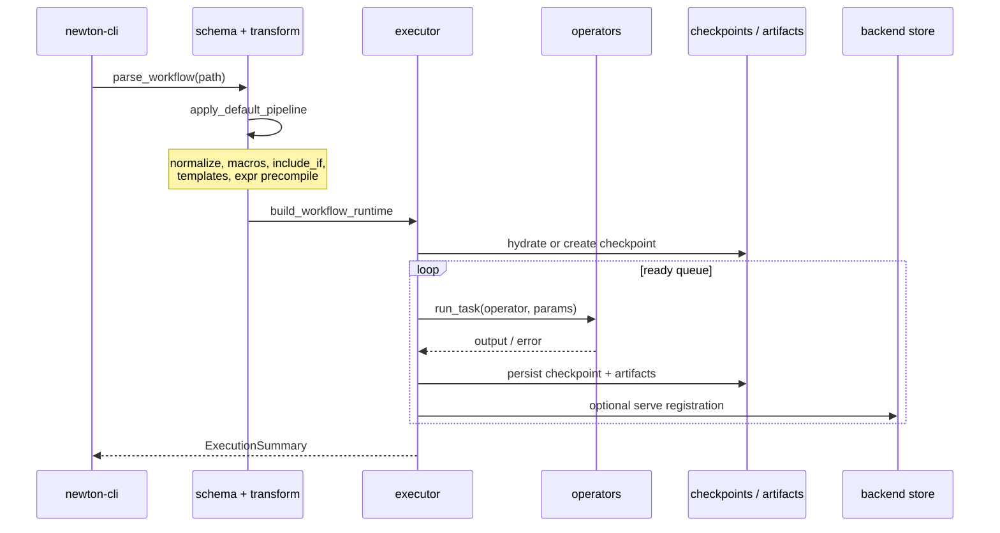

# Newton Architecture

This document describes Newton's system design for contributors and operators who need to understand how components fit together. End-user usage is in [README.md](README.md).

## Overview

Newton is a **hybrid** project: a Rust CLI binary (`newton`) backed by embeddable library crates. The core value is YAML-defined workflow graphs executed deterministically, with optional HTTP serve API, batch plan processing, MCP exposure, and human-in-the-loop gates via ailoop.



## Crate responsibilities

| Crate | Responsibility | Must not |
| --- | --- | --- |
| `newton-types` | Shared DTOs (`WorkflowInstance`, `ApiError`, portfolio types) used by core, backend, and OpenAPI generation | Depend on core or CLI |
| `newton-backend` | SQLite persistence: workflows runtime, plans, catalog, grades, opportunities | Depend on CLI |
| `newton-core` | Workflow parse/transform/execute, operators, checkpoints, batch config, HTTP router, ailoop/MCP integrations | Depend on clap or TUI crates |
| `newton-cli` | Argument parsing, command dispatch, logging bootstrap, MCP serve wiring | Contain business logic that belongs in core |
| `crates/test-utils` | Test fixtures and HTTP helpers for integration tests | Ship in the release binary |

**Dependency rule**: `newton-cli → newton-core → { newton-types, newton-backend }`.

## Workflow execution pipeline

A workflow run moves through these stages:



### 1. Parse and transform

- **Entry**: `crates/core/src/workflow/schema.rs` — YAML → `WorkflowDocument` (mode `workflow_graph`, version `2.0`).
- **Pipeline**: `crates/core/src/workflow/transform/pipeline.rs` applies transforms in order:
  1. Normalize schema
  2. Expand macros
  3. Apply `include_if` filtering
  4. Resolve `{{ template }}` strings
  5. Precompile `$expr` expressions

### 2. Build runtime

- **Entry**: `crates/core/src/workflow/executor/child_runner.rs` — `build_workflow_runtime()`.
- Constructs `GraphHandle` (task DAG), `ExpressionEngine`, `ArtifactStore`, checkpoint root under `.newton/state/workflows/`, and execution state (context, triggers, completed tasks).
- Validates required triggers, computes workflow hash for resume safety.

### 3. Execute graph

- **Entry**: `crates/core/src/workflow/executor/runtime.rs` — `WorkflowRuntime::run()`.
- Schedules tasks from a ready queue respecting `parallel_limit` and `max_time_seconds`.
- Each task: `crates/core/src/workflow/task_execution.rs` resolves params, applies timeout/retry, dispatches to the registered operator.

### 4. Operators

Built-in operators register in `crates/core/src/workflow/operators/mod.rs`:

| Operator | Module | Role |
| --- | --- | --- |
| `NoOpOperator` | `noop.rs` | Pass-through / routing |
| `CommandOperator` | `command.rs` | Shell execution |
| `SetContextOperator` | `set_context.rs` | Deep-merge context |
| `ReadControlFileOperator` | `read_control_file.rs` | Read JSON control files |
| `AssertCompletedOperator` | `assert_completed.rs` | Dependency assertions |
| `BarrierOperator` | `barrier.rs` | Synchronization |
| `WorkflowOperator` | `workflow.rs` | Nested workflow (in-process) |
| `AgentOperator` | `agent/` | aikit-sdk agent engines |
| `GhOperator` | `gh.rs` | GitHub CLI wrapper |
| `HumanApprovalOperator` | `human_approval.rs` | Boolean HITL gate |
| `HumanDecisionOperator` | `human_decision.rs` | Multiple-choice HITL gate |

Agent quota detection is delegated to **aikit-sdk** (`RunResult.quota_exceeded` → Newton error `WFG-AGENT-008`).

### 5. Checkpoints and artifacts

- Checkpoints: `crates/core/src/workflow/checkpoint.rs` — persisted under `.newton/checkpoints/`; enable `newton workflow resume`.
- Artifacts: `crates/core/src/workflow/artifacts.rs` — routed per graph settings to `.newton/artifacts/`.
- Run history: `.newton/state/workflows/<execution-id>/` plus optional SQLite rows via `newton-backend`.

### 6. Completion policy

Goal gates, terminal tasks, and explicit completion policy produce deterministic success/failure. Lint warnings (`workflow lint`) are advisory and do not block execution.

## Major subsystems

### Batch runner

Implemented primarily in `crates/cli/src/cli/commands/batch.rs` using `newton_core::core::batch_config` and the workflow executor.

Flow:

1. Discover workspace root (walk up to `.newton/`).
2. Load `.newton/configs/<project_id>.conf` (`project_root`, `workflow_file`).
3. Poll `.newton/plan/<project_id>/todo/` for plan markdown files.
4. Copy plan to `.newton/tasks/<task_id>/input/spec.md`.
5. Run configured workflow with plan path in trigger payload.
6. Move plan to `completed/` or `failed/`.

### HTTP serve API

- **Router**: `crates/core/src/api/mod.rs` — Axum 0.8, mounted at `/api/v1/`.
- **Modules**: workflows, streaming (SSE/WebSocket), HIL, operators, dashboard, portfolio, opportunities, plans, catalog, persistence, magic tools (aikit-magictool).
- **OpenAPI**: generated from utoipa annotations; canonical file at [openapi/newton-backend-parity.yaml](openapi/newton-backend-parity.yaml).
- **Realtime**: [openapi/newton-realtime.asyncapi.yaml](openapi/newton-realtime.asyncapi.yaml).
- **Static UI**: optional `--static-ui` serves a built frontend via `tower-http` `ServeDir`.

Health probes: `GET /healthz` (liveness), `GET /readyz` (readiness). Swagger UI at `GET /api/docs`.

### Backend store

- **Crate**: `newton-backend` — `SqliteBackendStore` in `crates/backend/src/store/`.
- Modular store: `catalog`, `eval`, `plan`, `workflow_runtime`, etc.
- Schema migrations in `crates/backend/migrations/`.
- SQL reference: [openapi/newton-backend-parity.sqlite.sql](openapi/newton-backend-parity.sqlite.sql).

Serve reads/writes through this store for portfolio, workflow instances, grades, and opportunities parity with the UI.

### MCP mode

Two topologies:

1. **Combined**: `newton serve --with-mcp` mounts MCP at `/mcp` on the serve port.
2. **Dedicated**: `newton mcp serve` on a separate port (default 8730).

Implementation: `crates/cli/src/cli/mcp.rs` and `framework_setup/mcp.rs`. Export policy `ExposeMcpOnly` limits which commands become MCP tools (`MCP_EXPOSED_COMMAND_IDS` in `framework_setup/mod.rs`).

### Ailoop (human-in-the-loop)

When enabled, Newton connects to ailoop over **WebSocket** (`ailoop-core`):

| Component | Direction | Purpose |
| --- | --- | --- |
| `OutputForwarder` | Newton → ailoop | Stream stdout/stderr |
| `OrchestratorNotifier` | Newton → ailoop | Notifications (with retry) |
| `WorkflowEmitter` | Newton → ailoop | Workflow progress events |
| `AiloopInterviewer` | bidirectional | Authorization and decision prompts |

Configuration resolves from env vars (`NEWTON_AILOOP_WS_URL`, `NEWTON_AILOOP_CHANNEL`, `NEWTON_AILOOP_INTEGRATION=1`) or `.newton/configs/*.conf`.

`resolve_interviewer()` selects `AiloopInterviewer` when a valid context exists; otherwise human operators fail with `HIL-AILOOP-001`. There is no console fallback.

### Logging and telemetry

- **Module**: `crates/core/src/logging/`
- File sink to `.newton/logs/newton.log`; optional OpenTelemetry export when configured.
- CLI maps subcommands to `LogInvocationKind` in `crates/cli/src/cli/log_invocation.rs`.

## Key design decisions

| Decision | Rationale |
| --- | --- |
| **Core/CLI separation** | Embed `newton-core` in servers and tests without pulling clap/TUI; CI enforces the boundary. |
| **Deterministic completion** | Goal gates and terminal tasks give predictable pass/fail semantics for automation and CI. |
| **Transform pipeline before execute** | Macros, includes, and templates resolve once so the executor sees a flat, validated graph. |
| **In-process sub-workflows** | `WorkflowOperator` reuses the same executor with nesting depth limits and path sandboxing. |
| **Quota via aikit-sdk** | Provider-agnostic agent quota detection; Newton maps to `WFG-AGENT-008` without parsing provider output. |
| **OpenAPI as contract** | Serve API parity is generated from Rust handlers; CI blocks drift. |
| **SQLite backend** | Single-file store for local serve and parity with portfolio UI; modular store API for future backends. |

## Technology stack

| Layer | Technology |
| --- | --- |
| Language | Rust 2021 edition |
| Async runtime | Tokio |
| CLI | clap 4 + cli-framework |
| HTTP | Axum 0.8, tower, tower-http |
| Persistence | SQLx + SQLite |
| Serialization | serde, serde_json, serde_yaml |
| Expressions | Rhai |
| Graph | petgraph |
| Agents | aikit-sdk, aikit-magictool (git deps) |
| HITL | ailoop-core (git dep, pinned rev) |
| API docs | utoipa → OpenAPI 3.1 |
| Testing | cargo test, insta snapshots, wiremock, assert_cmd |

Workspace version is defined in the root [Cargo.toml](Cargo.toml) (`workspace.package.version`).

## Data flow summary

```
YAML workflow file
    → parse + transform pipeline
    → WorkflowRuntime (graph + state + checkpoints)
    → OperatorRegistry (builtins + agent engines)
    → task outputs → context merge → next ready tasks
    → ExecutionSummary + artifacts + optional SQLite/API registration
```

For batch and serve, the same executor path is invoked; batch adds plan-file discovery and queue management, while serve adds concurrent HTTP access to stored workflow instances and streaming events.

## Related documents

- [docs/context.md](docs/context.md) — ubiquitous language (portfolio, plans, opportunities)
- [openapi/newton-backend-parity.yaml](openapi/newton-backend-parity.yaml) — HTTP API contract
- [CONTRIBUTING.md](CONTRIBUTING.md) — build, test, PR process
- [AGENTS.md](AGENTS.md) — contributor constraints
