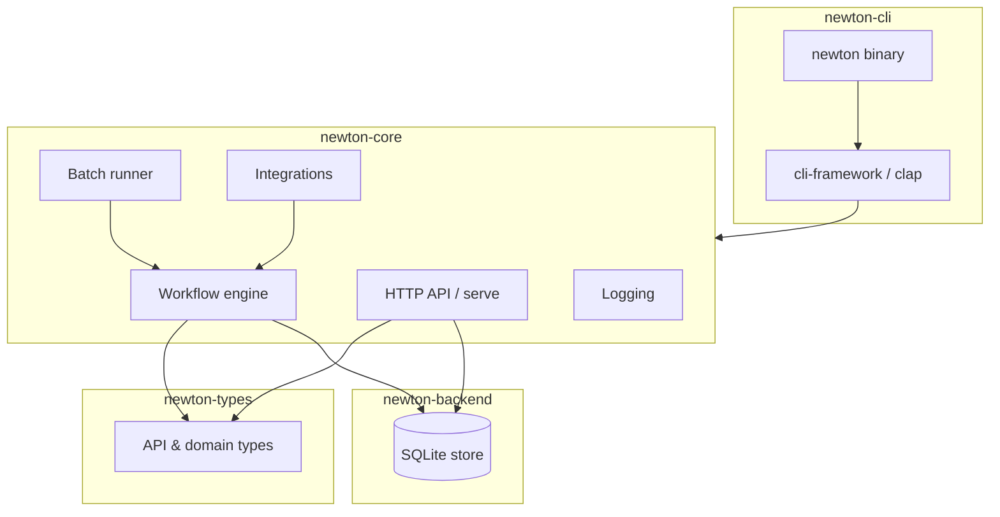
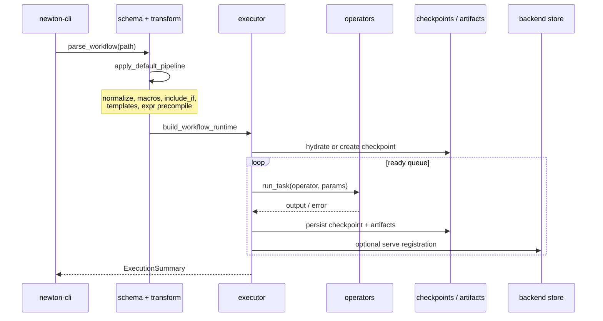

# Newton Architecture

This document describes Newton's system design for contributors and operators who need to understand how components fit together. End-user usage is in [README.md](README.md).

## Overview

Newton is a **hybrid** project: a Rust CLI binary (`newton`) backed by embeddable library crates. The core value is YAML-defined workflow graphs executed deterministically, with optional HTTP serve API, batch plan processing, MCP exposure, and human-in-the-loop gates via ailoop.



## Crate responsibilities

| Crate | Responsibility | Must not |
| --- | --- | --- |
| `newton-types` | Shared DTOs (`WorkflowInstance`, `ApiError`, portfolio types) used by core, backend, and OpenAPI generation | Depend on core or CLI |
| `newton-backend` | SQLite persistence: workflows runtime, plans, catalog, grades, opportunities | Depend on CLI |
| `newton-core` | Workflow parse/transform/execute, operators, checkpoints, batch config, HTTP router, ailoop/MCP integrations | Depend on clap or TUI crates |
| `newton-cli` | Argument parsing, command dispatch, logging bootstrap, MCP serve wiring | Contain business logic that belongs in core |
| `crates/test-utils` | Test fixtures and HTTP helpers for integration tests | Ship in the release binary |

**Dependency rule**: `newton-cli → newton-core → { newton-types, newton-backend }`.

## Workflow execution pipeline

A workflow run moves through these stages:



### 1. Parse and transform

- **Entry**: `crates/core/src/workflow/schema.rs` — YAML → `WorkflowDocument` (mode `workflow_graph`, version `2.0`).
- **Pipeline**: `crates/core/src/workflow/transform/pipeline.rs` applies transforms in order:
  1. Normalize schema
  2. Expand macros
  3. Apply `include_if` filtering
  4. Resolve `{{ template }}` strings
  5. Precompile `$expr` expressions

### 2. Build runtime

- **Entry**: `crates/core/src/workflow/executor/child_runner.rs` — `build_workflow_runtime()`.
- Constructs `GraphHandle` (task DAG), `ExpressionEngine`, `ArtifactStore`, checkpoint root under `.newton/state/workflows/`, and execution state (context, triggers, completed tasks).
- Validates required triggers, computes workflow hash for resume safety.

### 3. Execute graph

- **Entry**: `crates/core/src/workflow/executor/runtime.rs` — `WorkflowRuntime::run()`.
- Schedules tasks from a ready queue respecting `parallel_limit` and `max_time_seconds`.
- Each task: `crates/core/src/workflow/task_execution.rs` resolves params, applies timeout/retry, dispatches to the registered operator.

### 4. Operators

Built-in operators register in `crates/core/src/workflow/operators/mod.rs`:

| Operator | Module | Role |
| --- | --- | --- |
| `NoOpOperator` | `noop.rs` | Pass-through / routing |
| `CommandOperator` | `command.rs` | Shell execution |
| `SetContextOperator` | `set_context.rs` | Deep-merge context |
| `ReadControlFileOperator` | `read_control_file.rs` | Read JSON control files |
| `AssertCompletedOperator` | `assert_completed.rs` | Dependency assertions |
| `BarrierOperator` | `barrier.rs` | Synchronization |
| `WorkflowOperator` | `workflow.rs` | Nested workflow (in-process) |
| `AgentOperator` | `agent/` | aikit-sdk agent engines |
| `GhOperator` | `gh.rs` | GitHub CLI wrapper |
| `HumanApprovalOperator` | `human_approval.rs` | Boolean HITL gate |
| `HumanDecisionOperator` | `human_decision.rs` | Multiple-choice HITL gate |

Agent quota detection is delegated to **aikit-sdk** (`RunResult.quota_exceeded` → Newton error `WFG-AGENT-008`).

### 5. Checkpoints and artifacts

- Checkpoints: `crates/core/src/workflow/checkpoint.rs` — persisted under `.newton/checkpoints/`; enable `newton workflow resume`.
- Artifacts: `crates/core/src/workflow/artifacts.rs` — routed per graph settings to `.newton/artifacts/`.
- Run history: `.newton/state/workflows/<execution-id>/` plus optional SQLite rows via `newton-backend`.

### 6. Completion policy

Goal gates, terminal tasks, and explicit completion policy produce deterministic success/failure. Lint warnings (`workflow lint`) are advisory and do not block execution.

## Major subsystems

### Batch runner

Implemented primarily in `crates/cli/src/cli/commands/batch.rs` using `newton_core::core::batch_config` and the workflow executor.

Flow:

1. Discover workspace root (walk up to `.newton/`).
2. Load `.newton/configs/<project_id>.conf` (`project_root`, `workflow_file`).
3. Poll `.newton/plan/<project_id>/todo/` for plan markdown files.
4. Copy plan to `.newton/tasks/<task_id>/input/spec.md`.
5. Run configured workflow with plan path in trigger payload.
6. Move plan to `completed/` or `failed/`.

### HTTP serve API

- **Router**: `crates/core/src/api/mod.rs` — Axum 0.8, mounted at `/api/v1/`.
- **Modules**: workflows, streaming (SSE/WebSocket), HIL, operators, dashboard, portfolio, opportunities, plans, catalog, persistence, magic tools (aikit-magictool).
- **OpenAPI**: generated from utoipa annotations; canonical file at [openapi/newton-backend-parity.yaml](openapi/newton-backend-parity.yaml).
- **Realtime**: [openapi/newton-realtime.asyncapi.yaml](openapi/newton-realtime.asyncapi.yaml).
- **Static UI**: optional `--static-ui` serves a built frontend via `tower-http` `ServeDir`.

Health probes: `GET /healthz` (liveness), `GET /readyz` (readiness). Swagger UI at `GET /api/docs`.

### Backend store

- **Crate**: `newton-backend` — `SqliteBackendStore` in `crates/backend/src/store/`.
- Modular store: `catalog`, `eval`, `plan`, `workflow_runtime`, etc.
- Schema migrations in `crates/backend/migrations/`.
- SQL reference: [openapi/newton-backend-parity.sqlite.sql](openapi/newton-backend-parity.sqlite.sql).

Serve reads/writes through this store for portfolio, workflow instances, grades, and opportunities parity with the UI.

### MCP mode

Two topologies:

1. **Combined**: `newton serve --with-mcp` mounts MCP at `/mcp` on the serve port.
2. **Dedicated**: `newton mcp serve` on a separate port (default 8730).

Implementation: `crates/cli/src/cli/mcp.rs` and `framework_setup/mcp.rs`. Export policy `ExposeMcpOnly` limits which commands become MCP tools (`MCP_EXPOSED_COMMAND_IDS` in `framework_setup/mod.rs`).

### Ailoop (human-in-the-loop)

When enabled, Newton connects to ailoop over **WebSocket** (`ailoop-core`):

| Component | Direction | Purpose |
| --- | --- | --- |
| `OutputForwarder` | Newton → ailoop | Stream stdout/stderr |
| `OrchestratorNotifier` | Newton → ailoop | Notifications (with retry) |
| `WorkflowEmitter` | Newton → ailoop | Workflow progress events |
| `AiloopInterviewer` | bidirectional | Authorization and decision prompts |

Configuration resolves from env vars (`NEWTON_AILOOP_WS_URL`, `NEWTON_AILOOP_CHANNEL`, `NEWTON_AILOOP_INTEGRATION=1`) or `.newton/configs/*.conf`.

`resolve_interviewer()` selects `AiloopInterviewer` when a valid context exists; otherwise human operators fail with `HIL-AILOOP-001`. There is no console fallback.

### Logging and telemetry

- **Module**: `crates/core/src/logging/`
- File sink to `.newton/logs/newton.log`; optional OpenTelemetry export when configured.
- CLI maps subcommands to `LogInvocationKind` in `crates/cli/src/cli/log_invocation.rs`.

## Key design decisions

| Decision | Rationale |
| --- | --- |
| **Core/CLI separation** | Embed `newton-core` in servers and tests without pulling clap/TUI; CI enforces the boundary. |
| **Deterministic completion** | Goal gates and terminal tasks give predictable pass/fail semantics for automation and CI. |
| **Transform pipeline before execute** | Macros, includes, and templates resolve once so the executor sees a flat, validated graph. |
| **In-process sub-workflows** | `WorkflowOperator` reuses the same executor with nesting depth limits and path sandboxing. |
| **Quota via aikit-sdk** | Provider-agnostic agent quota detection; Newton maps to `WFG-AGENT-008` without parsing provider output. |
| **OpenAPI as contract** | Serve API parity is generated from Rust handlers; CI blocks drift. |
| **SQLite backend** | Single-file store for local serve and parity with portfolio UI; modular store API for future backends. |

## Technology stack

| Layer | Technology |
| --- | --- |
| Language | Rust 2021 edition |
| Async runtime | Tokio |
| CLI | clap 4 + cli-framework |
| HTTP | Axum 0.8, tower, tower-http |
| Persistence | SQLx + SQLite |
| Serialization | serde, serde_json, serde_yaml |
| Expressions | Rhai |
| Graph | petgraph |
| Agents | aikit-sdk, aikit-magictool (git deps) |
| HITL | ailoop-core (git dep, pinned rev) |
| API docs | utoipa → OpenAPI 3.1 |
| Testing | cargo test, insta snapshots, wiremock, assert_cmd |

Workspace version is defined in the root [Cargo.toml](Cargo.toml) (`workspace.package.version`).

## Data flow summary

```
YAML workflow file
    → parse + transform pipeline
    → WorkflowRuntime (graph + state + checkpoints)
    → OperatorRegistry (builtins + agent engines)
    → task outputs → context merge → next ready tasks
    → ExecutionSummary + artifacts + optional SQLite/API registration
```

For batch and serve, the same executor path is invoked; batch adds plan-file discovery and queue management, while serve adds concurrent HTTP access to stored workflow instances and streaming events.

## Glossary — implementation & internal terms

Domain language (loop, grading, portfolio, evaluation, planning, dependency
mapping) lives in [CONTEXT.md](CONTEXT.md). The terms below are data-shape and
engine internals — relocated here from the former `docs/context.md`.

### Workflow definition (IR)

| Term | Definition | Aliases to avoid |
| --- | --- | --- |
| **Workflow** | A directed graph of interconnected **Tasks**, defined in YAML — a guarded state machine, **not** a DAG: transitions may form bounded cycles (loops), with priority-ordered, `when`-guarded edges and first-match traversal. The primary unit Newton orchestrates. | Pipeline, job, script, DAG |
| **WorkflowDocument** | Root YAML container: `{ version, mode, macros, triggers, metadata, workflow }`. Version `2.0`, mode `workflow_graph`. | Config, spec file |
| **WorkflowDefinition** | Executable core nested inside a **WorkflowDocument**: `{ context, settings, tasks }`. | — |
| **WorkflowSettings** | Execution-control configuration: entry task, time limits, parallelism, checkpoint policy, completion policy, artifact storage, redaction. | Config, options |
| **Context** | A JSON object of global state threaded through all tasks. Seeded in the definition; mutated at runtime by `SetContextOperator`. `context.<key>` in expressions. | Variables, state bag |
| **Trigger Payload** | The JSON input to a workflow. Supplied via `--trigger KEY=VALUE` or `--parameters-json`. `triggers.payload` in expressions. | Parameters, inputs, args |
| **IoBlock** | The workflow's I/O contract: `{ input_schema, output_schema, result_map, error_schema }`. | Schema, contract |
| **Macro** / **MacroInvocation** | A named reusable list of task templates; a reference to one with optional parameter substitution `{ macro, with }`. | Template, include |

### Tasks

| Term | Definition | Aliases to avoid |
| --- | --- | --- |
| **Task** | A single unit of work in a workflow DAG: `id`, `operator`, `params`, optional **Transitions**, **RetryPolicy**, `timeout_ms`. | Step, action, node |
| **Operator** | A pluggable executor that carries out a task. Receives `params` and **ExecutionContext**; returns a JSON value. | Handler, runner, plugin |
| **OperatorRegistry** | The registry mapping operator names to `Operator` implementations. Built once before each run. | — |
| **Transition** | A directed edge between tasks: `{ to, when?, include_if?, priority, label? }`. | Edge, link |
| **Condition** (`when` / `include_if`) | A Rhai guard on a **Transition** or task inclusion. `include_if` skips the task; `when` skips only the edge. | Guard, filter |
| **Entry Task** | The first task executed; defaults to `"start"`, overridden via `settings.entry_task`. | Start node |
| **Parallel Group** | A tag grouping tasks that may run concurrently, bounded by `settings.parallel_limit`. | Thread group, fork |
| **RetryPolicy** | Per-task retry config `{ max_attempts, backoff_ms, backoff_multiplier, jitter_ms }`. | Retry config |
| **Goal Gate** / **Goal Gate Group** | A task marked `goal_gate: true`; with `require_goal_gates`, at least one (per group) must succeed for the **Execution** to complete. | Milestone |
| **Terminal Task** | A task marked `terminal: success|failure`; reaching it immediately resolves the **Execution**. | End task, exit node |

### Execution

| Term | Definition | Aliases to avoid |
| --- | --- | --- |
| **Execution** | A single run of a workflow, identified by `execution_id` (UUID). The backend data-model term. Persisted under `.newton/state/workflows/<id>/`. | Run, instance |
| **Instance** | The UI/API surface term for an **Execution** (`WorkflowInstance`, `instance_id`). Prefer **Execution** in backend contexts. | — |
| **Execution ID** | UUID for an **Execution**. CLI `--run-id` and UI `instance_id` are aliases. | Run ID |
| **ExecutionStatus** | `Running | Completed | Failed | Cancelled` (UI adds `paused`). | State, result |
| **Stage** | A human-readable phase label on an **Execution** in the UI; not stored in the core record. | Phase |
| **NodeState** | UI/API state of a **Task** within an **Instance** (`pending | running | succeeded | failed | timeout | cancelled`); corresponds to backend **TaskStatus**. | Task state |
| **TaskOutcome** | Backend result of one task: id, context patch, success flag, timing, error summary, resolved params. | Task result |
| **Task Run Sequence** (`run_seq`) | Monotonic per-task attempt counter within one execution. | Attempt number |
| **StateView** | Immutable snapshot `{ context, tasks, triggers }` passed to operators/expressions. | Snapshot |
| **ExecutionContext** | Per-task runtime container: workspace, `execution_id`, `task_id`, iteration, **StateView**, **OperatorRegistry**, nesting depth. | Runtime context |
| **Nesting Depth** | Sub-workflow recursion level (0 = root); bounds `WorkflowOperator` recursion. | — |
| **ExecutionTestResult** | Test outcome in the Execution Center: `passed | failed | running`. | — |

### Checkpointing & durability

| Term | Definition | Aliases to avoid |
| --- | --- | --- |
| **Checkpoint** | A persisted execution snapshot enabling **Resume**, at `.newton/state/workflows/<id>/checkpoint.json`. | Savepoint |
| **WorkflowCheckpoint** | The checkpoint structure: `{ execution_id, workflow_hash, ready_queue, context, trigger_payload, task_iterations, completed, runtime_tasks, io_snapshot }`. | — |
| **Ready Queue** | Task IDs queued to execute at checkpoint time; restored verbatim on **Resume**. | Work queue |
| **Resume** | Restarting from the last **Checkpoint** via `newton workflow resume --run-id <UUID>`. | Restart |
| **Artifact** | Task output too large to inline; stored under `.newton/artifacts/` by SHA-256. | File output, blob |
| **OutputRef** | Discriminated union: `Inline(Value)` or `Artifact { path, size_bytes, sha256 }`. | — |
| **Audit Log** | Append-only `.jsonl` recording all HIL interactions, at `.newton/state/workflows/<id>/audit.jsonl`. | Interaction log |

### Human-in-the-loop (HIL)

| Term | Definition | Aliases to avoid |
| --- | --- | --- |
| **HIL Event** | A human-intervention request from a **HumanApprovalOperator**/**HumanDecisionOperator**: `event_type` (`question | authorization`), `status` (`pending | resolved | timedout | cancelled`). | Approval request |
| **HIL Action** | A human's response: `text`, `authorization_approved`, `authorization_denied`, `timeout`, `cancelled`. | Response |
| **HumanApprovalOperator** | Pauses for a boolean approve/deny: `{ approved, reason, timestamp }`. | Approval gate |
| **HumanDecisionOperator** | Pauses for a multiple-choice/text response: `{ choice, label, timestamp, timeout_applied, default_used }`. | Decision gate |
| **Timeout Behavior** | On no response within `timeout_seconds`, returns `default_choice` if set, else fails `WFG-HUMAN-105`. | — |

### Built-in operators

| Term | Definition |
| --- | --- |
| **CommandOperator** | Executes a shell command; captures stdout/stderr as JSON. |
| **SetContextOperator** | Deep-merges a JSON patch into the workflow **Context**. |
| **NoOpOperator** | Pass-through for routing/branching without side effects. |
| **WorkflowOperator** | Runs a nested workflow in-process, incrementing **Nesting Depth**. |
| **BarrierOperator** / **AssertCompletedOperator** | Block until a set of task IDs complete. |
| **AgentOperator** | Runs an AI agent engine via aikit-sdk with **Signal**-based output routing; checkpoint/resume. |
| **GhOperator** | Wraps the GitHub CLI for PR and project operations; checkpoint/resume. |
| **ReadControlFileOperator** | Reads/parses a JSON file at a runtime-resolved path into task output. |

### Agent execution

| Term | Definition | Aliases to avoid |
| --- | --- | --- |
| **Engine** | The AI backend for an **AgentOperator**: `claude`, `codex`, `gemini`, `opencode`, … Per-task or via `settings.default_engine`. | Model, provider |
| **Signal** | A named mapping from an agent output event (`success | failure | timeout | invalid_output`) to a target **Transition**. | Callback, hook |
| **ModelStylesheet** | Workflow-level agent model config `{ model, context_fidelity }`. | Model config |
| **ContextFidelity** | History retained by the agent: `Full | Summary | Truncate`. | Memory mode |

### Expressions

| Term | Definition | Aliases to avoid |
| --- | --- | --- |
| **Expression** | A Rhai script in YAML computing dynamic values/conditions over `{ context, tasks, triggers }`. | Script, formula |
| **`$expr`** | YAML marker that a field value is an **Expression**: `{ $expr: "context.version == 'v1'" }`. | — |
| **Template Interpolation** | `{{ expr }}` syntax in string fields; expands the result inline. | String templating |

### Real-time & UI

| Term | Definition | Aliases to avoid |
| --- | --- | --- |
| **ConnectionStatus** | WebSocket/SSE state: `disconnected | connecting | connected | reconnecting`. | Socket state |
| **BroadcastEvent** | A WS notification carrying only IDs; the UI re-fetches via REST. Types: `workflowInstanceUpdated`, `nodeStateChanged`, `logMessage`, `hilEvent`. | Push event |
| **WorkflowMonitor** | The three-pane UI: instance list, DAG graph, task detail. | Dashboard |
| **Magic Button** / **DraftCard** | A UI pattern where AI generates a draft a human reviews before applying; the review surface for it. Never auto-applied. | Auto-fill |
| **SavedView** | A persisted filter/column configuration for portfolio or repository lists. | Filter preset |
| **PendingApproval** | A dashboard item for a **Plan**/**Execution** awaiting review; carries `risk`, `confidence`, `expectedValue`. | Action item |
| **RecentAction** | An activity-feed entry: `agent | exec | approval | regression | deferral`. | Audit entry |

### Diagnostics & workspace

| Term | Definition | Aliases to avoid |
| --- | --- | --- |
| **Lint** | Static analysis of a workflow file; findings of severity `Error | Warning | Info`. | Validate, check |
| **Error Code** | A prefixed failure id: `WFG-*`, `HIL-*`, `WFG-EXPR-*`, `WFG-TIME-*`, `WFG-AGENT-*`. | Error key |
| **Workspace** | The directory containing a `.newton/` folder, discovered by walking up. | Project root |
| **`.newton/`** | Workspace root for all Newton state, configs, plans, artifacts, logs. | Newton dir |

### Flagged ambiguities (implementation)

- **Execution (backend) vs. Instance (UI)** — same entity; prefer **Execution** in backend/data/CLI, **Instance** in UI/realtime. Never mix within one layer.
- **Run vs. Execution** — `--run-id` is a CLI display alias for `execution_id`; prefer **Execution** in code/docs.
- **Checkpoint vs. task-level sync** — **Checkpoint** always means the persisted snapshot for **Resume**; use **Goal Gate**/**Barrier** for task synchronization.
- **Context vs. ExecutionContext** — **Context** is the user-facing JSON state in expressions; **ExecutionContext** is the internal operator runtime struct. Distinct.
- **Autonomy vs. Policy Level** — same enum/concept; **Autonomy** in portfolio contexts, **Policy Level** in execution/governance.
- **Operator (person) vs. Operator (plugin)** — prefer **human operator** for the person, **Operator** for the plugin abstraction.
- **NodeState (UI) vs. TaskStatus (backend)** — backend `Success | Failed | Skipped`; UI finer-grained. Use the layer-appropriate term.
- **"Release" is not a first-class entity** — Newton emits an **Impact Sequence** (an ordering), turned into existing **Plans**/**Executions**; there is no stored "Release".
- **Retry vs. Iteration** — two distinct re-execution mechanisms, often conflated. **Retry** = re-running the *same* task after a failure within one visit (`RetryPolicy`, engine-level, no graph movement). **Iteration** = re-*entering* a task by traversing a back-edge transition, bounded by `max_iterations` (graph-level). "Loop" means Iteration, never Retry.

## Related documents

- [CONTEXT.md](CONTEXT.md) — domain glossary (loop, grading, portfolio, planning, dependency mapping)
- [openapi/newton-backend-parity.yaml](openapi/newton-backend-parity.yaml) — HTTP API contract
- [CONTRIBUTING.md](CONTRIBUTING.md) — build, test, PR process
- [AGENTS.md](AGENTS.md) — contributor constraints
