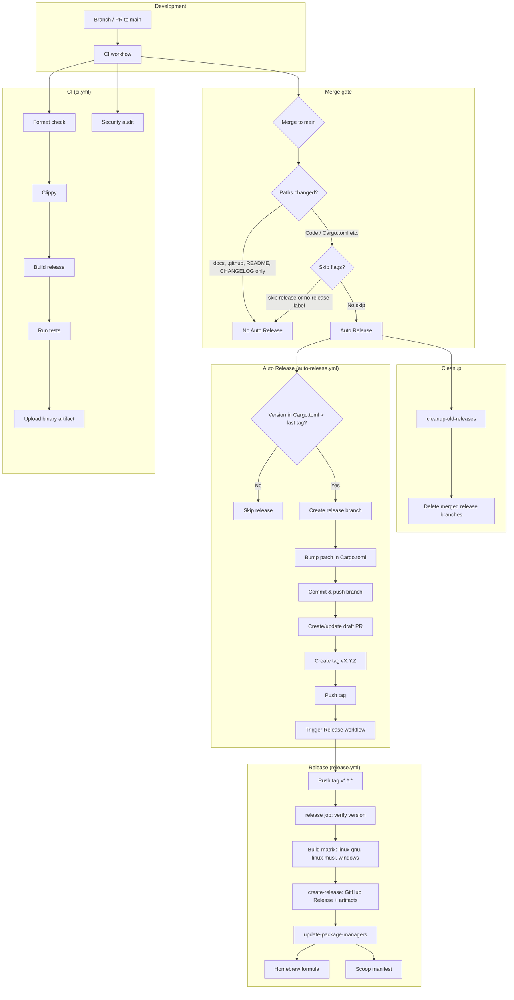

# Deployment Playbook

This document describes the CI/CD process for newton: validations, stages, and how to ship code through the pipeline to GitHub releases and package managers (Homebrew, Scoop).

**Quick overview.** Pushes and pull requests to `main` run **CI** (format, clippy, build, tests, security audit). After a merge to `main`, **Auto Release** runs only if code or versioned files changed (not docs-only), the commit does not say `[skip release]`, and the PR did not have the `no-release` label. When it runs, it checks whether `Cargo.toml` version is greater than the latest tag; if so, it creates a release branch, bumps the patch version, opens a draft PR, pushes a tag `vX.Y.Z`, and triggers the **Release** workflow. The Release workflow builds Linux (glibc and musl) and Windows binaries, publishes the GitHub Release with artifacts, then updates the Homebrew formula and Scoop manifest. A separate cleanup job removes merged or stale release branches. To release, bump the version in `Cargo.toml` before or in the merge to `main`; to avoid a release, use `[skip release]` or the `no-release` label.

## CI/CD Overview

## Validations and stages

### 1. CI workflow (`ci.yml`)

**Triggers:** `push` to `main`, `pull_request` to `main`.

| Stage           | What runs |
|-----------------|-----------|
| Checkout        | Repository checkout. |
| Rust toolchain  | `rustfmt`, `clippy` components. |
| Cache           | Cargo registry, git, `target`. |
| Format check    | `cargo fmt --all -- --check`. |
| Clippy          | `cargo clippy --all-targets --all-features -- -D warnings`. |
| Build           | `cargo build --release`. |
| Tests           | `cargo test --all-features`. |
| Upload artifact | Binary `newton` as `newton-linux-x86_64`. |
| Security audit  | Separate job: `cargo audit` (Rust advisory DB); `continue-on-error: true`. |

All of these must pass (other than the optional security audit) before merging.

### 2. Merge and Auto Release gate

After merge to `main`:

- **Paths ignored for Auto Release:** `.github/**`, `docs/**`, `README.md`, `CHANGELOG.md`. Pushes that only touch these do not run Auto Release.
- **Skip conditions:** Commit message contains `[skip release]`, or PR has label `no-release` (auto-release job is skipped).
- If Auto Release runs, it only proceeds when **version in `Cargo.toml` is greater than the latest tag** (i.e. you must bump version on main for a release).

### 3. Auto Release workflow (`auto-release.yml`)

**Triggers:** `push` to `main` (with path and skip conditions above).

| Stage                 | What runs |
|-----------------------|-----------|
| Check version         | Compare `Cargo.toml` version to last tag; set skip if unchanged. |
| Create release branch | Branch `auto-release-<current_version>` from main; delete existing remote/local branch if present. |
| Bump patch            | Increment patch in `Cargo.toml` on the release branch. |
| Commit & push         | Commit version bump, push branch with `--force-with-lease`. |
| Create/update PR      | Draft PR base `main` head release branch, label `auto-release`; update body/title if PR exists. |
| Create tag & push     | Tag `vX.Y.Z` (bumped version), push tag (triggers Release). |
| Trigger Release       | `gh workflow run release.yml -f tag="$TAG" --ref main`. |

**Cleanup job (same workflow):** On push to `main`, deletes remote branches for merged release PRs, or branches older than 7 days with no PR.

### 4. Release workflow (`release.yml`)

**Triggers:** `push` of tags matching `v*.*.*`.

| Stage              | What runs |
|--------------------|-----------|
| Checkout           | Repository at the tag ref. |
| Verify version     | Tag version (e.g. `v0.3.9`) must match `version` in `Cargo.toml`; fail otherwise. |
| Build (matrix)     | Three targets: `x86_64-unknown-linux-gnu`, `x86_64-unknown-linux-musl`, `x86_64-pc-windows-msvc`; musl job installs `musl-tools`. |
| Create archives    | Per target: copy binary to `dist/`, create `.tar.gz` or `.zip`, upload artifact. |
| Create GitHub Release | Download all artifacts, generate release notes, create release for the tag with `artifacts/**/*`. |
| Update package managers | After successful release: update `gonewton/homebrew-cli` (formula) and `gonewton/scoop-bucket` (manifest) via scripts and push. |

### 5. Post-release checks

- **Homebrew:** Formula URL, version, and hash should match the new release.
- **Scoop:** Manifest should point at the new version and asset URLs.

---

## Deployment checklist

Use this checklist when shipping code through the pipeline.

### 1. Prepare the change locally

1. Verify the tree is clean: `git status -sb`.
2. Implement the feature/fix and update docs/tests.
3. Run the same checks as CI:
   - `cargo fmt`
   - `cargo clippy --all-targets --all-features -- -D warnings`
   - `cargo test --all-features`
4. Bump `version` in `Cargo.toml` when the change is release-worthy (Auto Release only runs when version is greater than last tag).
5. Commit with a conventional message, e.g. `feat(cli): add new flag`.

### 2. Push and monitor CI

1. Open a PR to `main` or push to `main`.
2. Find the CI run: `gh run list --limit 5` (workflow `CI`).
3. Watch until it finishes: `gh run watch <CI_RUN_ID> --exit-status`.
4. If it fails, fix locally and repeat.

### 3. Track Auto Release

1. After merging to `main`, find the Auto Release run: `gh run list --limit 5` (workflow `Auto Release`).
2. Watch it: `gh run watch <AUTO_RELEASE_RUN_ID> --exit-status`.
3. A draft PR and tag will be created; pull the release branch/tag if you need them locally: `git fetch --tags && git pull`.

### 4. Ensure the Release workflow runs

1. Auto Release pushes a tag (e.g. `v0.3.9`). To re-tag after a fix: `git push origin :refs/tags/vX.Y.Z` then `git push origin vX.Y.Z`.
2. Confirm Release ran: `gh run list --workflow Release --limit 3`.
3. Watch the run: `gh run watch <RELEASE_RUN_ID> --exit-status`.
4. Verify the release: `gh release view vX.Y.Z`.

### 5. Validate package-manager updates

1. Homebrew formula (URL/version/hash):
   - `gh api repos/gonewton/homebrew-cli/contents/Formula/newton.rb?ref=main --jq '.content' | base64 -d`
2. Optionally check the Scoop manifest in `gonewton/scoop-bucket`.

### 6. Verify via Homebrew locally

1. `brew update`
2. `brew upgrade newton` (or `brew install newton`)
3. `newton --version` and `newton --help` (banner should show the new version).

### 7. Troubleshooting

- Inspect failures: `gh run view <RUN_ID> --log`.
- If Auto Release did not run: ensure `Cargo.toml` version was bumped and the merge was not skip-gated (paths, `[skip release]`, `no-release` label).
- If Release fails on version mismatch: tag and `Cargo.toml` at that tag must match; fix version and re-tag.
- Release workflow runs on **tag push**; the ref used is the tag (so `Cargo.toml` at the tag must have the same version as the tag).
